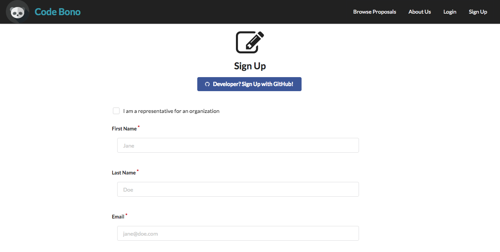
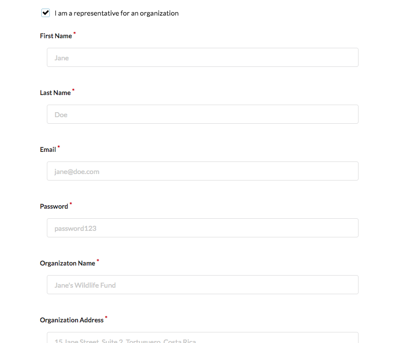
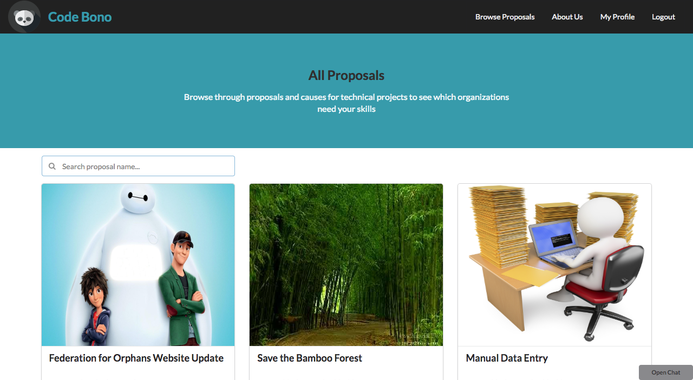
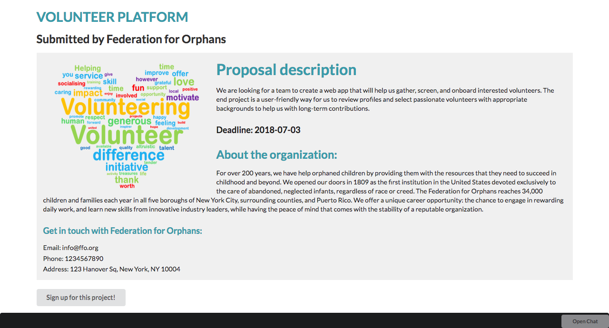
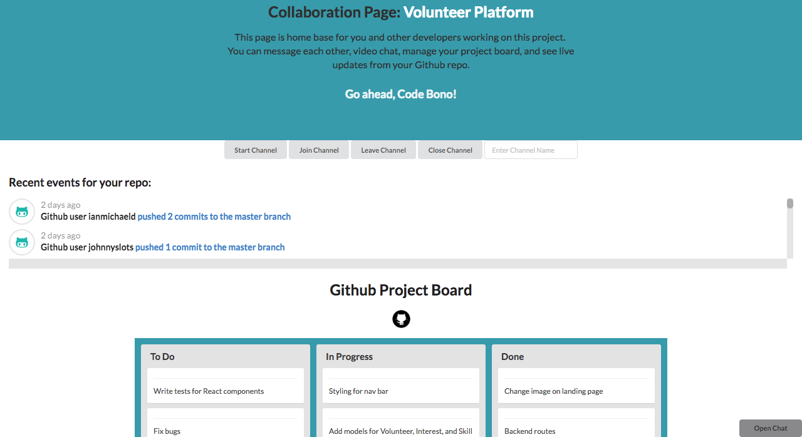

## Code-Bono!

The perfect platform to match eager and well-meaning developers with great organizations in need of tech talent on a project-based basis. Code Bono is a platform that connects nonprofit organizations with software developers looking to contribute their skills through pro bono work. Code Bono is a web application built using React, Redux, Express, Socket.io, and GitHub API Integration.

## Signing Up 

When signing up, a user can opt to sign up, as either a developer or as an organization. The user also has the option of signing up with their GitHub account.

#### Developer Sign Up View
 

  

#### Organization Sign Up View
Accessible by checking the 'I am a representative for an organization' checkbox.

  

## Browsing for proposals 
Developers can browse proposals posted by nonprofits and form teams by selecting a project that interests them. Developers can also use the search bar to browse for proposals.

  

#### Single Proposal View
Clicking on a proposal will take the developer to the single proposal view, where they can read about the details and choose to sign up for the project. Developers can also see how many other developers have signed up for the project.

  

## Collaboration Page
Once a team is formed for a project, users gain access to a shared collaboration space which includes GitHub Project Board integration and realtime video and text chat capabilities.

  

